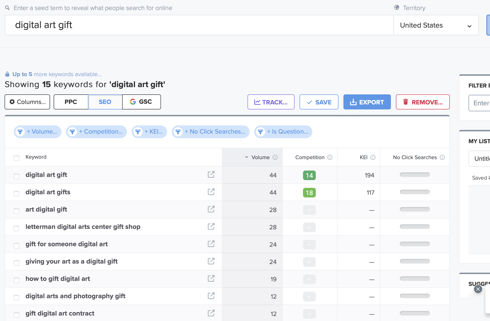
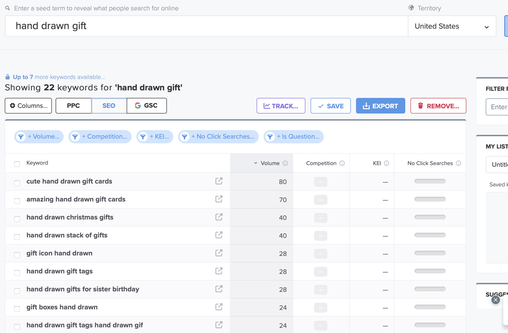
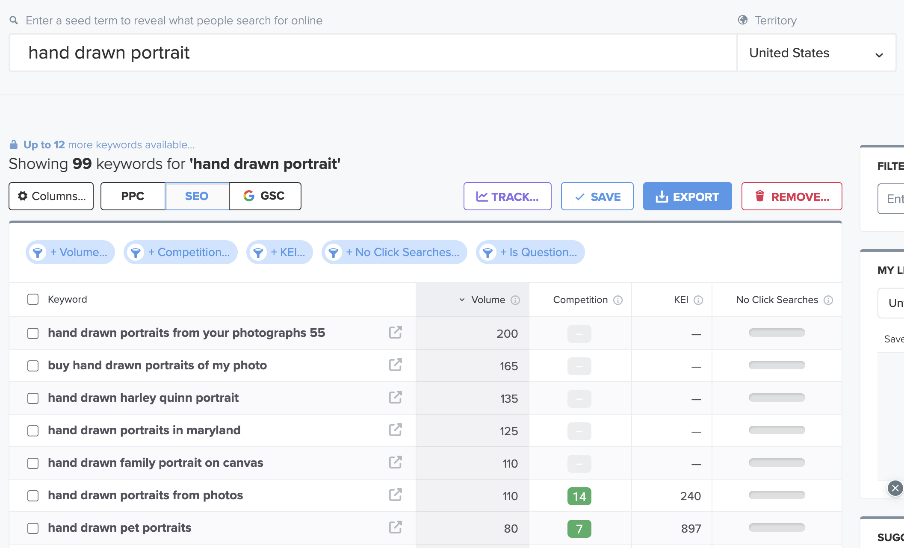
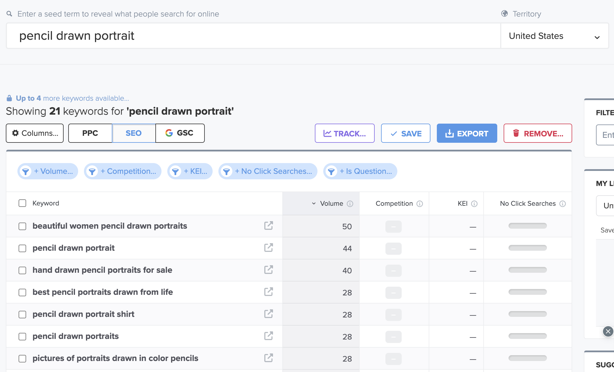
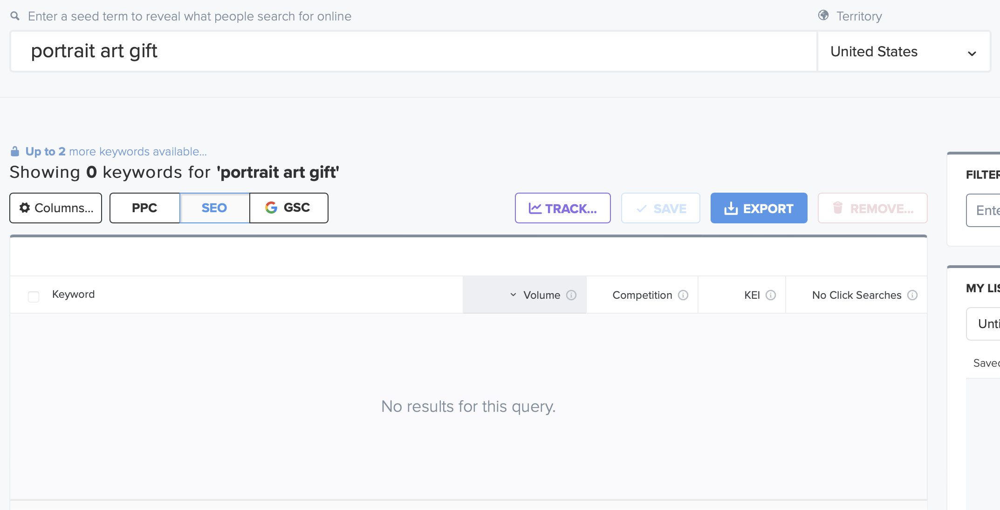
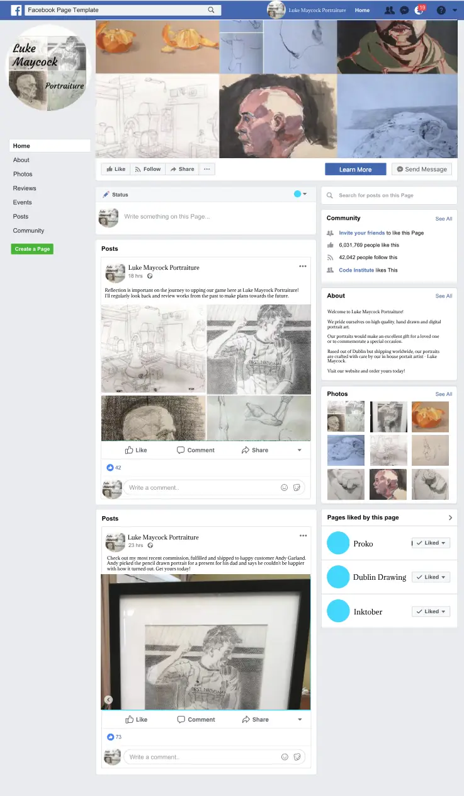

# SEO and Marketing Research

## Table of Contents

- [Keyword Research](#keyword-research)
- [Research of similar businesses](#research-of-similar-businesses)
- [SEO Improvements](#seo-improvements)
- [Marketing Strategies](#marketing-strategies)

## Keyword Research

### Initial list of Keywords to research

- digital art gift
- hand drawn gift
- hand drawn portrait
- pencil drawn portrait
- portrait art gift

### Testing Keywords for volume and competition

I tested several long-tail keywords using the website [Wordtracker](https://www.wordtracker.com/).
Most keywords showed extremely low volume and competition, though some terms showed relatively high rates of competition which might mean leaving them out of meta tags.

## Research of similar businesses

Luke Maycock Portraiture was an idea inspired by platforms like [Fiverr](https://www.fiverr.com/categories/graphics-design).

On Fiverr, artists host their art and design skills, but Fiverr take a flat rate cut of what is earned, driving prices up. With an independent platform I could run a B2C type art platform with a competitive advantage of not having to charge more to compensate for fees on websites like Fiverr, Etsy or Redbubble.

## SEO Improvements

**Meta tags**

In the head of base.html, ``<meta name="description" ...`` and ``<meta name="keywords" ...`` tags were included. 

**Creating a Sitemap**

The sitemap file sitemap.xml was created using [XML Sitemaps](https://www.xml-sitemaps.com/) to improve navigation of the site for search engines and to speed up content discovery.

**Creating a robots.txt file**

The file instructs search engines which directories not to crawl and index. It also links to the sitemap.
The existence of this file signals a level of quality to search engines and so improves SEO ranking as a result.

## Marketing Strategies

### Pre-strategy planning

Luke Maycock Portraiture is B2C business concept. It produces and sells its own products and has a limited distribution range.

Before deciding on marketing strategies and defining a business plan, I tried to answer the following question to provide a framework for the business' strategy:

**Which online platforms would you find lots of your users on?**

Fiverr, Etsy, Redbubble, Society6. Any web platform on which art is sold.

**What do your users need? Could you meet that need with useful content? If yes, how could you best deliver that content to them?**

Users need thoughtful and personal gift giving solutions. Paying for a portrait piece is a great way to show someone you care and the hand drawn / pencil aspect lets the gift receiver know a lot of thought and effort went into the present.

**Would your business run sales or offer discounts? How do you think your users would most like to hear about these offers?**

Discounts for repeat customers to inscentivise repeat customers.

I've also considered "lock-in rates". Essentially, as the business grows the amount I would be able to charge for portraits would also increase. A lock-in rate would mean that if a customer has purchased a portrait at a certain price point, they would be locked in at that rate for return purchases, inscentivising them becoming repeat customers if they enjjoy their purchasing experience.

**What are the goals of your business? Which marketing strategies would offer the best ways to meet those goals?**

My goal is to provide a bespoke service for thoughtful gift giving.

**Would your business have a budget to spend on advertising? Or would it need to work with free or low cost options to market itself?**

I would rely on word-of-mouth marketing and free online marketing solutions.

Although paying for ad space would increase footfall to the website, my available art slots may not be able to keep up.

### Strategies

Any paid marketing strategies were beyond the scope and requirements for this project as it is a fictional business created by a student.

- **Social Media Marketing => Mock FB page**

    

    The Facebook page is a way to reach out and spread the word through more text based channels than just Instagram.

    This should also reach a different demographic as the average age of the Facebook userbase skews older than that of Instagram / Tik Tok.

- **Email Marketing => MailChimp Newsletter**

    The MailChimp Newsletter subscription service is ideal for a small scale business like mine.
    A newsletter could stand to spread the word about future portrait commission openings and get customers ready for when new products go live on the website.
    The newsletter subscription is completely optional for customers. The service is represented on the site in the footer as a small form, rather than an obtrusive pop-up so many other sites resort to these days.
